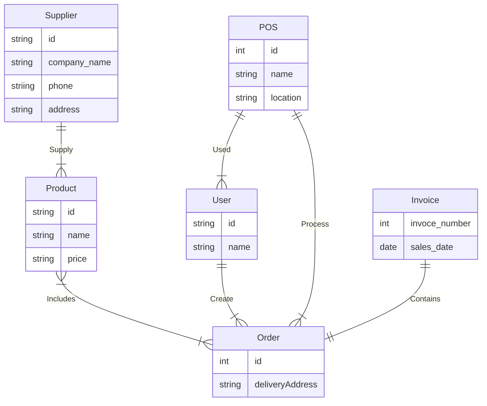

Antes de iniciar el desarrollo, es fundamental tener una comprensión clara de los objetivos y los límites de nuestra aplicación. Durante la fase de planificación, es importante definir el alcance de la aplicación y establecer los casos de uso y funcionalidades. Normalmente, esta tarea es asignada a una persona de producto, que puede tener diferentes títulos dependiendo de la estructura de la empresa (product owner, product manager, etc.). Esta persona, que no suele ser técnica, trabaja en colaboración con los diseñadores para crear diseños de interfaz de usuario, teniendo en cuenta las necesidades específicas del producto, la usabilidad y la experiencia del usuario.

En nuestro caso, asumiremos todos los roles, lo que significa que tenemos la responsabilidad de definir hasta dónde queremos que llegue nuestra aplicación y qué diseños utilizaremos.

## Requerimientos funcionales

Nuestra aplicación tendrá dos secciones principales: **la sección de administración** y **la sección de puntos de venta** (POS, en inglés). Con esto en mente, identificaremos y declararemos los diferentes casos de uso para cada sección de la aplicación.

El alcance inicial de la aplicación incluye tanto desde el lado de administración como desde el lado de los puntos de venta (POS).

Desde el lado de administración, se incluye la posibilidad de registrar y administrar productos, proveedores, puntos de venta y usuarios. Además, se incluye un dashboard con gráficas variadas.

Desde el lado del POS, se incluye la administración de pedidos y la creación de facturas para las ventas realizadas. Esto permitirá tener una gestión eficiente de las operaciones de venta.

Con estas funcionalidades, el alcance inicial de la aplicación está enfocado en brindar una solución completa para la gestión de los puntos de venta.

A continuación, te presento un backlog priorizado que incluye las funcionalidades necesarias para alcanzar el alcance inicial de la aplicación. Este backlog se ha organizado y agrupado en hitos, incluyendo tanto la administración de productos, proveedores y usuarios, como también la administración de pedidos y la creación de facturas desde la perspectiva del POS. Con la implementación de estas funcionalidades, la aplicación brindará una solución completa para la gestión de los puntos de venta. En cada hito, no solo trabajaremos en las funcionalidades específicas de ese hito, sino que también incluiremos la tarea de despliegue de la aplicación en el entorno de producción.

### Hito 1: Configuración inicial
- Configuración del entorno de desarrollo local
- CRUD de productos
- CRUD de usuarios
- CRUD de proveedores
- CRUD de POS

### Hito 2: Funcionalidades del panel de control
- Dashboard con gráficas variadas

### Hito 3: Funcionalidades del POS
- Administración de pedidos
- Creación de facturas para las ventas

## Diseño de la interfaz de usuario

Además de los requerimientos funcionales, es importante tener en cuenta también la parte visual de la aplicación. Para este proyecto, se han seleccionado diseños específicos en base a mi gusto personal y mi experiencia en el desarrollo de aplicaciones similares. Los diseños están disponibles en [Figma]() y brindan una guía visual para que como desarrolladores tengamos una idea clara de cómo lucirá la aplicación, asegurándonos de que los diseños sean claros y coherentes con las funcionalidades definidas en el backlog.

Es importante destacar que estos diseños son meramente una sugerencia y pueden ser modificados y mejorados de acuerdo con las necesidades específicas de cada uno de sus proyectos de prueba, pero son un buen punto de partida si no se tiene mucha idea de diseño. Además, en empresas suelen ser diseñados por profesionales de UI/UX. En este contexto, he elegido estos diseños, pero es importante tener en cuenta que se pueden personalizar según sea necesario.

## Diseño de la base de datos

El diseño de la base de datos es un aspecto fundamental para garantizar la eficiencia y la integridad de la información en una aplicación. En este proyecto, se ha creado un Modelo Entidad-Relación que permite organizar y estructurar los datos de manera clara y coherente. Este diseño incluye las siguientes entidades: Productos (Products), Proveedores (Supplier), puntos de venta (POS), usuarios (User) y pedidos (Order), así como las relaciones correspondientes entre ellas. Con esta estructura, se asegura que los datos sean accesibles de manera fácil y que se cumplan los requisitos de integridad y consistencia en la base de datos. Este diseño es una guía que ayudará a desarrollar una base de datos eficiente y adaptable a las necesidades futuras del proyecto.

| Tabla    | Descripción | 	Relación con otras tablas |
| -------- | ----------- | -------------------------- |
| Product  | Almacena información detallada de los productos, como el nombre, descripción, precio, entre otros. | Relacionada con la tabla Order a través de la relación muchos a muchos.|
| Supplier | Almacena información de los proveedores, incluyendo el nombre, dirección, información de contacto, entre otros.|Relacionada con la tabla Product a través de una relación de uno a muchos.|
| Point of Sale (POS) |Almacena información de los puntos de venta, como la ubicación, la dirección, la información de contacto, entre otros.|Relacionada con la tabla Order a través de una relación de uno a muchos.|
| User |Almacena información de los usuarios que tienen acceso a la aplicación, incluyendo el nombre de usuario, contraseña, información de contacto, entre otros.|Relacionada con la tabla Order a través de una relación de uno a muchos.|
| Order	 | Almacena información de los pedidos, incluyendo el usuario que realiza el pedido, el producto ordenado, la fecha, el total, entre otros.| Relacionada con la tabla Product, Supplier, POS y User a través de relaciones de muchos a uno.|
| Invoice | ||

